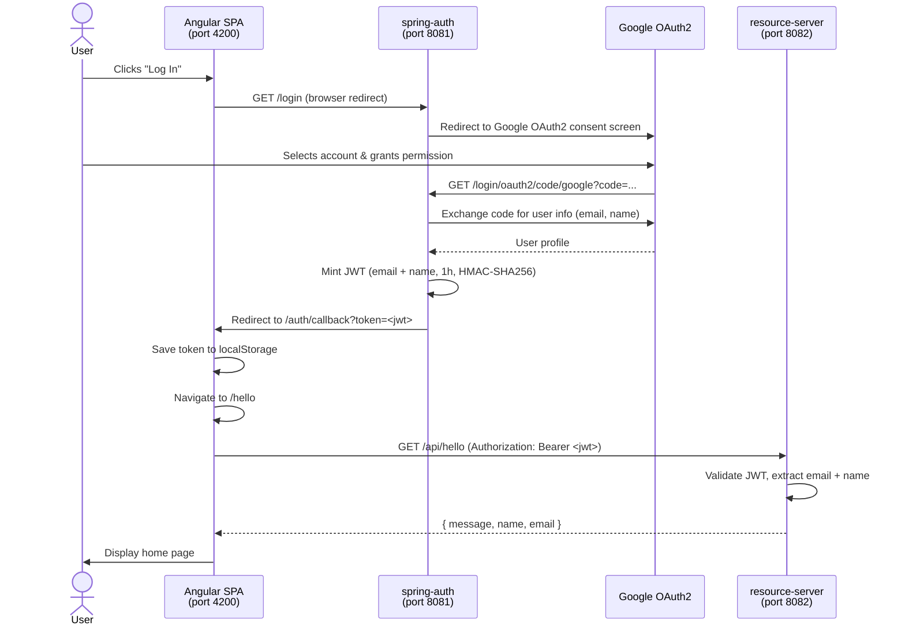
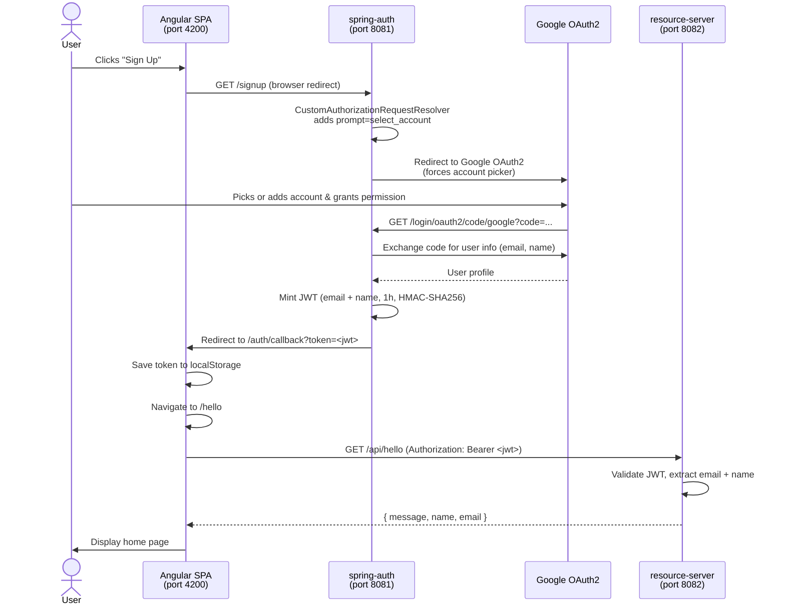

# OAuth2 + JWT Authentication Demo

A three-service demo application implementing Google OAuth2 login with JWT-based API authorization.

## Architecture

```
[Angular SPA :4200] → [Spring Auth :8081] → Google OAuth2
                              ↓
                        mints JWT token
                              ↓
[Angular SPA :4200] → [Resource Server :8082] (validates JWT)
```

| Service | Tech | Port | Role |
|---|---|---|---|
| `spring-auth` | Spring Boot | 8081 | Handles Google OAuth2 login/signup, mints JWT |
| `resource-server` | Spring Boot | 8082 | Validates JWT, exposes protected REST API |
| `web-client` | Angular 17 | 4200 | SPA — initiates OAuth flow, stores token, calls API |

## Sequence Diagrams

### Login



### Signup



> **Login vs Signup:** The only difference is that `/signup` forces Google to show the account picker (`prompt=select_account`), useful when a user wants to sign in with a different account than the one already in their browser session.

## Prerequisites

- A Google OAuth2 application ([Google Cloud Console](https://console.cloud.google.com/)) with:
  - Authorized redirect URI: `http://localhost:8081/login/oauth2/code/google`

## Running with Docker (recommended)

The easiest way to run all three services at once.

**Requires:** Docker + Docker Compose

### 1. Clone the repo

```bash
git clone https://github.com/tanveer3567/oauth-jwt-demo.git
cd oauth-jwt-demo
```

### 2. Set up environment variables

```bash
cp docker/.env.example docker/.env
# Edit docker/.env and fill in your GOOGLE_CLIENT_ID and GOOGLE_CLIENT_SECRET
```

### 3. Build and start all services

```bash
cd docker
docker compose up --build
```

First build takes a few minutes (downloads Maven/Node dependencies). Subsequent runs are fast.

### 4. Open the app

Navigate to [http://localhost:4200](http://localhost:4200) and click **Login**.

To stop: `docker compose down`

---

## Running Locally (without Docker)

**Requires:** Java 17, Maven, Node.js + npm

### 1. Clone the repo

```bash
git clone https://github.com/tanveer3567/oauth-jwt-demo.git
cd oauth-jwt-demo
```

### 2. Start the auth service (port 8081)

```bash
cd spring-auth
GOOGLE_CLIENT_ID=<your-client-id> \
GOOGLE_CLIENT_SECRET=<your-client-secret> \
mvn spring-boot:run
```

### 3. Start the resource server (port 8082)

```bash
cd resource-server
mvn spring-boot:run
```

> Both services share the same JWT secret. In production, set `JWT_SECRET` to the same value on both:
> ```bash
> JWT_SECRET=<your-secret> mvn spring-boot:run
> ```

### 4. Start the Angular frontend (port 4200)

```bash
cd web-client
npm install
npm start
```

### 5. Open the app

Navigate to [http://localhost:4200](http://localhost:4200) and click **Login**.

## Environment Variables

| Variable | Required | Default | Description |
|---|---|---|---|
| `GOOGLE_CLIENT_ID` | Yes | — | Google OAuth2 client ID |
| `GOOGLE_CLIENT_SECRET` | Yes | — | Google OAuth2 client secret |
| `JWT_SECRET` | No | `my-very-secret-key-change-in-prod` | HMAC-SHA256 signing key — **change in production** |

## Running Tests

Tests exist for the `spring-auth` service only (unit + integration). No tests for `resource-server` or `web-client`.

```bash
cd spring-auth
mvn test
```

Covered areas: `AppProperties`, `SecurityConfig`, `AuthController`, `CustomAuthorizationRequestResolver`, `OAuth2AuthenticationSuccessHandler`.

## Building (without running)

```bash
# Auth service
mvn package -f spring-auth/pom.xml

# Resource server
mvn package -f resource-server/pom.xml

# Frontend
cd web-client && npm run build
```

## Project Structure

```
oauth-jwt-demo/
├── docker/                   # Docker setup
│   ├── docker-compose.yml
│   ├── .env.example
│   ├── spring-auth/Dockerfile
│   ├── resource-server/Dockerfile
│   └── web-client/
│       ├── Dockerfile
│       └── nginx.conf
├── spring-auth/              # Auth service — Google OAuth2 + JWT minting
│   └── src/main/java/com/example/springauth/
│       ├── config/           # Security config, app properties
│       ├── controller/       # Auth endpoints
│       └── security/         # OAuth2 success handler, request resolver
├── resource-server/          # Protected API — JWT validation
│   └── src/main/java/com/example/hellobackend/
│       ├── config/           # Security config
│       ├── controller/       # GET /api/hello
│       └── security/         # JwtAuthFilter, UserPrincipal
└── web-client/               # Angular 17 SPA
    └── src/app/
        ├── auth/             # Auth callback, guard, service
        ├── hello/            # Hello component + service
        └── home/             # Home/landing page
```
